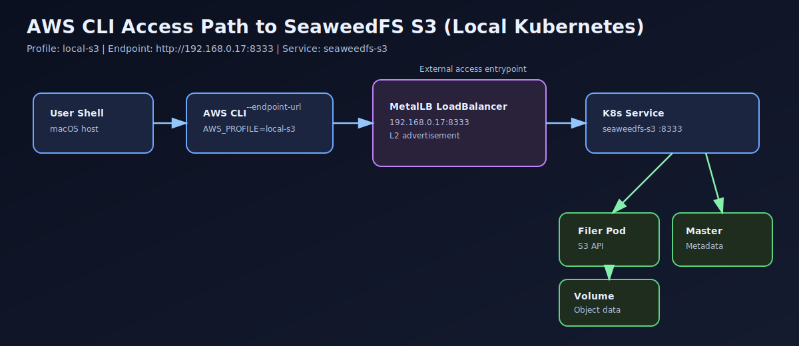

# AWS CLI Access to SeaweedFS S3 on Local Kubernetes

A polished public runbook for setting up and troubleshooting AWS CLI access to a SeaweedFS S3 service exposed through Kubernetes + MetalLB LoadBalancer.

## Quick links
- Main runbook: docs/awscli-seaweedfs-s3-access.md
- Architecture image: assets/architecture.svg

## Preview

## What this includes
- Step-by-step setup record
- Mermaid architecture diagram
- SVG architecture visual for easy GitHub preview
- Troubleshooting matrix (symptom -> cause -> verify -> fix)
- Validation checklist and copy/paste quick start
- Collapsible advanced troubleshooting section

## Direct URL
https://github.com/rkinginflux/awscli-seaweedfs-k8s-access-runbook/blob/main/docs/awscli-seaweedfs-s3-access.md
