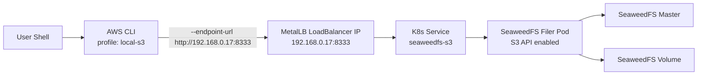

# Runbook: AWS CLI access to SeaweedFS S3 on local Kubernetes (LoadBalancer)

## TL;DR
Use a dedicated AWS profile and always pass the S3-compatible endpoint:

```bash
unset AWS_ACCESS_KEY_ID AWS_SECRET_ACCESS_KEY AWS_SESSION_TOKEN
export AWS_PROFILE=local-s3
aws --endpoint-url http://192.168.0.17:8333 s3 ls
```

## Table of contents
- Environment
- Architecture
- What was done
- Troubleshooting matrix
- Advanced troubleshooting (collapsible)
- Validation checklist
- Operational notes
- Quick start

---

## Environment
- Kubernetes context: `kubernetes-admin@kubernetes`
- Namespace: `s3`
- S3 service: `seaweedfs-s3`
- S3 API port: `8333`
- Load balancer: MetalLB
- External service IP: `192.168.0.17`

---

## Architecture

### Visual (SVG)


### Mermaid source


---

## What was done

### 1) Verified cluster and SeaweedFS S3 service state
```bash
kubectl get svc -A
kubectl get pods -n s3 -o wide
kubectl get svc -n s3 seaweedfs-s3 -o wide
```

Result: `seaweedfs-s3` was initially `ClusterIP` (not externally reachable).

### 2) Installed AWS CLI
```bash
brew install awscli
aws --version
```

### 3) Confirmed SeaweedFS S3 IAM user/key state
```bash
kubectl exec -n s3 seaweedfs-filer-0 -- sh -lc 'weed shell -master=seaweedfs-master-0.seaweedfs-master.s3:9333 <<"EOF"
s3.user.list
s3.accesskey.list -user admin
EOF'
```

Then created an additional access key for CLI usage.

Security note:
- Never publish real access keys or secret keys in docs/commits.
- Rotate credentials if they are ever exposed.

### 4) Configured local AWS profile
Files:
- `~/.aws/credentials`
- `~/.aws/config`

Template:
```ini
# ~/.aws/credentials
[local-s3]
aws_access_key_id = <YOUR_ACCESS_KEY>
aws_secret_access_key = <YOUR_SECRET_KEY>
```

```ini
# ~/.aws/config
[profile local-s3]
region = us-east-1
output = json
```

### 5) Diagnosed credential override issue
Observed failure:
- `InvalidAccessKeyId` even when profile looked correct.

Root cause:
- Shell env vars were overriding profile values:
  - `AWS_ACCESS_KEY_ID`
  - `AWS_SECRET_ACCESS_KEY`
  - `AWS_SESSION_TOKEN`

Fix:
```bash
unset AWS_ACCESS_KEY_ID AWS_SECRET_ACCESS_KEY AWS_SESSION_TOKEN
export AWS_PROFILE=local-s3
```

### 6) Initial validation via port-forward
```bash
kubectl port-forward -n s3 svc/seaweedfs-s3 8333:8333
aws --endpoint-url http://127.0.0.1:8333 s3 ls
```

### 7) Switched service to LoadBalancer
```bash
kubectl patch svc -n s3 seaweedfs-s3 --type merge -p '{"spec":{"type":"LoadBalancer"}}'
kubectl get svc -n s3 seaweedfs-s3 -o wide
```

Result:
- Service type: `LoadBalancer`
- Endpoint: `http://192.168.0.17:8333`

### 8) Final verification against LoadBalancer endpoint
```bash
unset AWS_ACCESS_KEY_ID AWS_SECRET_ACCESS_KEY AWS_SESSION_TOKEN
export AWS_PROFILE=local-s3

aws --endpoint-url http://192.168.0.17:8333 s3 ls
aws --endpoint-url http://192.168.0.17:8333 s3 ls s3://lab/
aws --endpoint-url http://192.168.0.17:8333 s3 cp /tmp/file.txt s3://lab/file.txt
```

---

## Troubleshooting matrix

| Symptom | Likely cause | How to verify | Fix |
|---|---|---|---|
| `InvalidAccessKeyId` | Wrong key OR env vars overriding profile | `aws configure list --profile local-s3` and `env | grep '^AWS_'` | `unset AWS_ACCESS_KEY_ID AWS_SECRET_ACCESS_KEY AWS_SESSION_TOKEN`; re-check profile keys |
| `SignatureDoesNotMatch` | Secret mismatch, stale creds, or wrong endpoint | `aws configure list --profile local-s3` | Update `~/.aws/credentials`; ensure correct endpoint URL |
| `AccessDenied` | IAM user/policy not permitting action | SeaweedFS shell: `s3.user.list`, `s3.accesskey.list -user <user>` | Create/rotate key, attach appropriate policy/permissions |
| `Could not connect to endpoint URL` | Service unreachable / wrong endpoint / network path | `kubectl get svc -n s3 seaweedfs-s3 -o wide` and test with `curl http://192.168.0.17:8333` | Ensure LoadBalancer IP assigned and reachable; confirm port 8333 |
| Hangs/timeouts | Firewall/L2 advertisement/routing issue | `kubectl get ipaddresspools.metallb.io -A`; `kubectl get l2advertisements.metallb.io -A` | Fix MetalLB pool/advertisement and host network reachability |
| `NoSuchBucket` | Bucket name typo or bucket absent | `aws --endpoint-url http://192.168.0.17:8333 s3 ls` | Create bucket or correct bucket name |
| Works with port-forward but not LoadBalancer | External LB path issue | Compare `127.0.0.1:8333` vs `192.168.0.17:8333` tests | Debug MetalLB/host network and service exposure |

---

## Advanced troubleshooting (collapsible)

<details>
<summary>Credential source precedence quick check</summary>

```bash
aws configure list --profile local-s3
env | grep '^AWS_' || true
```

Interpretation:
- If `access_key` or `secret_key` show `TYPE=env`, env vars are overriding your profile.
- Unset env vars and retry.

</details>

<details>
<summary>Validate SeaweedFS IAM objects from filer shell</summary>

```bash
kubectl exec -n s3 seaweedfs-filer-0 -- sh -lc 'weed shell -master=seaweedfs-master-0.seaweedfs-master.s3:9333 <<"EOF"
s3.user.list
s3.accesskey.list -user admin
s3.bucket.list
EOF'
```

</details>

<details>
<summary>Validate LoadBalancer assignment and MetalLB state</summary>

```bash
kubectl get svc -n s3 seaweedfs-s3 -o wide
kubectl get ipaddresspools.metallb.io -A
kubectl get l2advertisements.metallb.io -A
```

</details>

---

## Validation checklist
- [ ] `aws --version` shows installed CLI
- [ ] `kubectl get svc -n s3 seaweedfs-s3 -o wide` shows `LoadBalancer` with external IP
- [ ] `AWS_PROFILE=local-s3` is set for session
- [ ] AWS credential env vars are unset (unless intentionally used)
- [ ] `aws --endpoint-url http://192.168.0.17:8333 s3 ls` succeeds

---

## Operational notes
- Always use `--endpoint-url` for S3-compatible APIs.
- Prefer profile-based auth for repeatability.
- If auth unexpectedly changes, inspect active credential sources:

```bash
aws configure list --profile local-s3
env | grep '^AWS_'
```

---

## Quick start

```bash
unset AWS_ACCESS_KEY_ID AWS_SECRET_ACCESS_KEY AWS_SESSION_TOKEN
export AWS_PROFILE=local-s3
aws --endpoint-url http://192.168.0.17:8333 s3 ls
```
